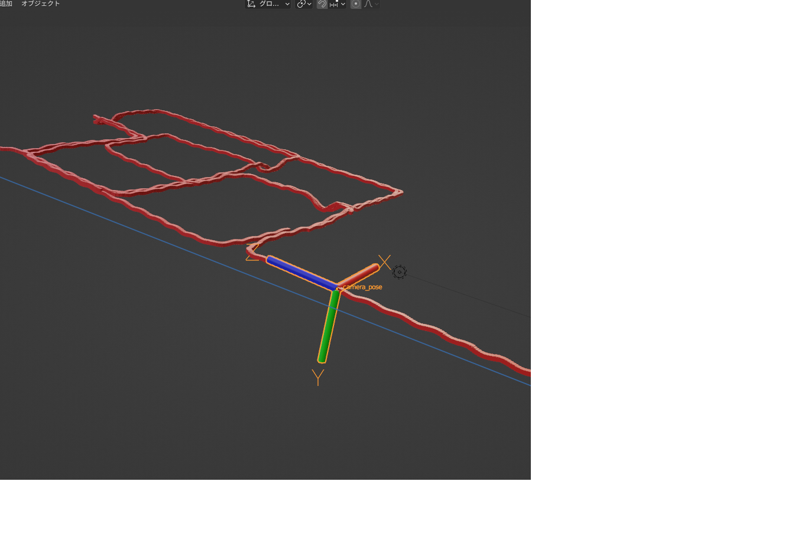

# Blender用SLAM実行結果可視化スクリプト

## 動作確認環境
| 項目 | 内容 |
| :--- | :--- | 
| OS | Windows 11 Pro |
| OS Build | 22621.2428 |
| RAM | 32GB |
| CPU | Intel(R) Core(TM) i7-10750H CPU  |
| GPU  | NVIDIA GeForce RTX 2080 |
| blender | 3.6 |

---
## 環境構築

Blenderのインストールフォルダ (ここではblender3.6)に移動して必要なpythonライブラリをインストールする：
```
$ ./blender3.6/3.6/python/bin/python.exe -m pip install scipy 
```

---
## 実行スクリプト説明
- blender起動後に`スクリプト作成` → `開く` → `rotation_matrix_visualizer.pyを選択` 
- rotation_matrix_visualizer.pyの9~11行目を対応する入力データのパスに書き換える
- スクリプトの実行 (開くの横の三角アイコン)

↓ 実行例、<span style="color: green; ">緑点</span>が読み込まれた環境データで<span style="color: red; ">赤点</span>がフレームごとの姿勢行列から計算された事故位置の軌跡


カメラの位置姿勢は以下のオブジェクトでアニメーション付きで可視化される



## サンプルデータ
stella-vslamの`aist_living_lab_1`データセットと処理結果を利用させていただきました
https://github.com/stella-cv/stella_vslam

入力データ
- RTsフォルダ: 各フレームごとに、4x4カメラ位置姿勢行列をtxt出力したものを配置するフォルダ
- map.ply: 上記の位置姿勢行列計算時に出力された環境地図
- RT_txt_list.txt: 本スクリプトで処理するRTs内のファイルのリスト